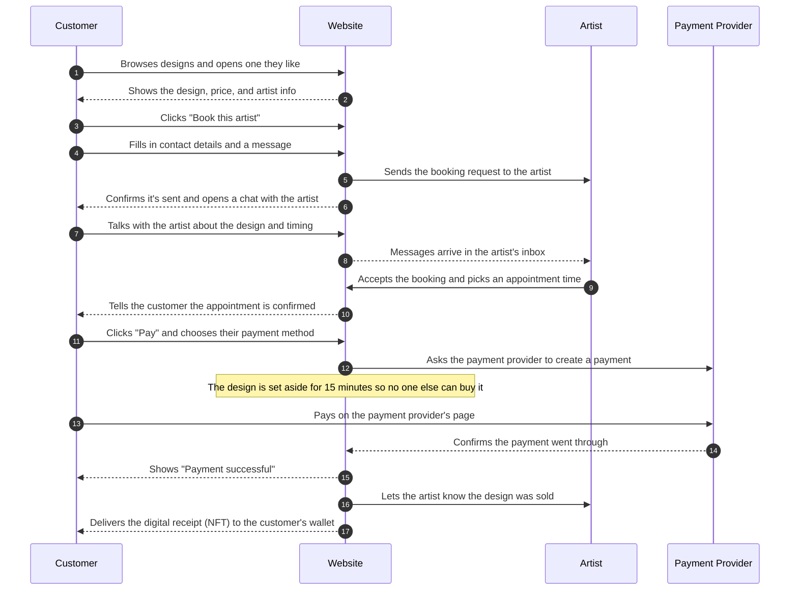
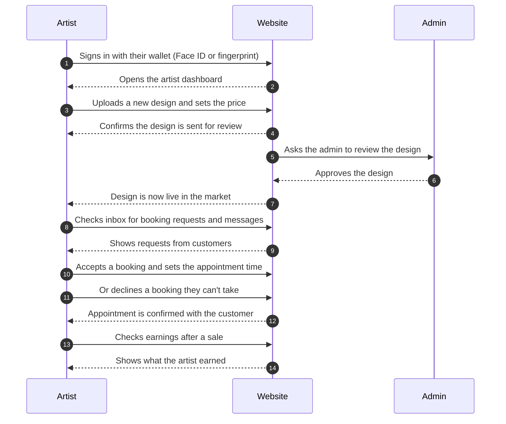
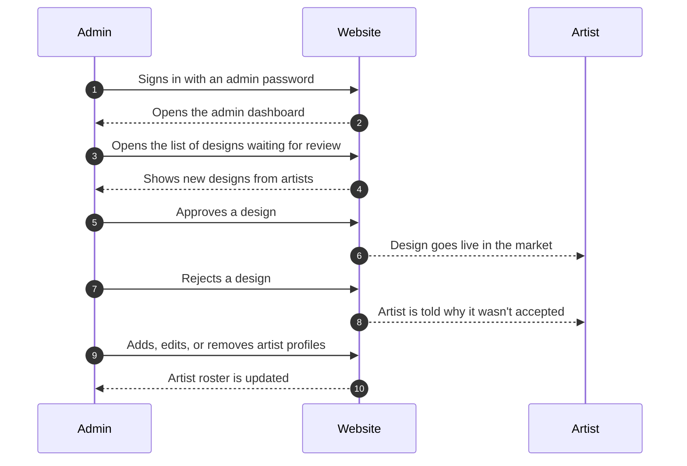
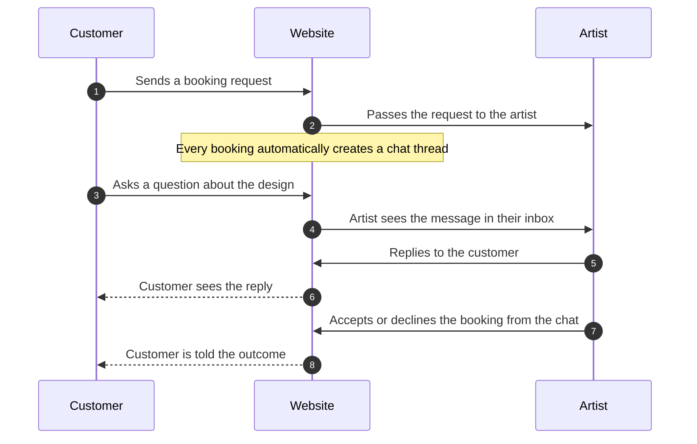

# App Flow — a Simple Guide

Sequence diagrams that tell the story of how the marketplace works, in plain language.
The "Website" in each diagram does all the behind-the-scenes work automatically.

---

## 1. Customer Journey — Buying a Design

---

## 2. Artist Journey — Selling and Managing Bookings

---

## 3. Admin Journey — Keeping the Marketplace Safe

---

## 4. Why Booking and Chat Go Together

